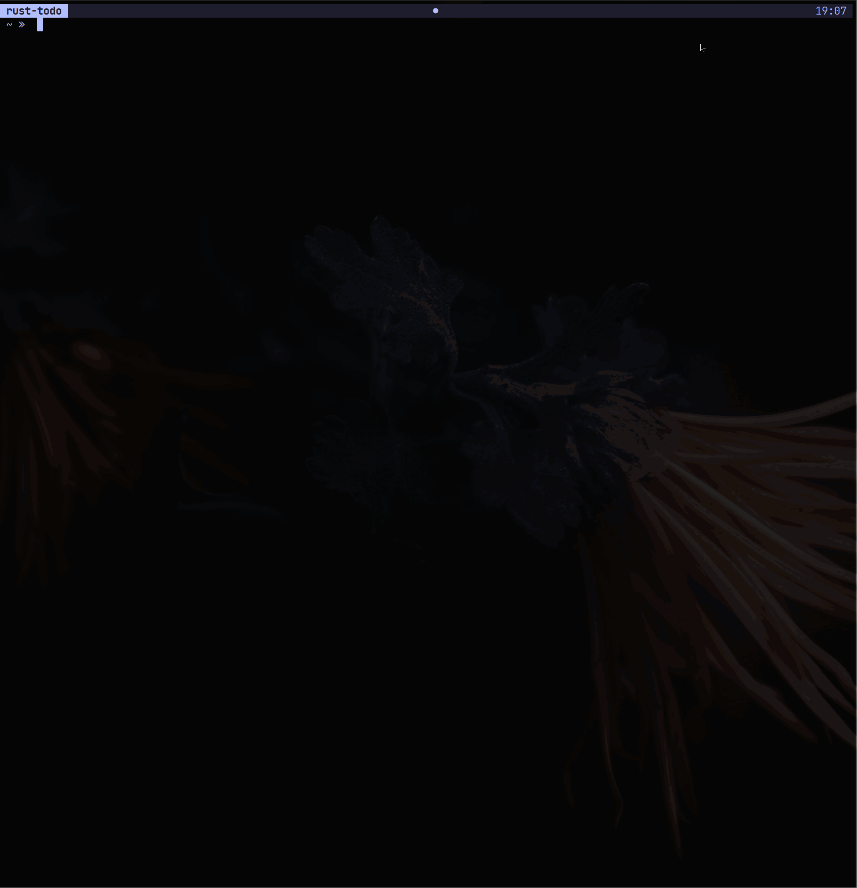

# Rust Terminal Todo App

<div align="center">
<br>
<br>
  <div>
    
  </div>
<br>
</div>

## Overview



Welcome to the Rust Terminal Todo App! This is a simple command-line todo application with a user-friendly interface written in Rust. It is inspired by projects like [ gitui ](https://github.com/extrawurst/gitui) and [ lazygit ](https://github.com/jesseduffield/lazygit), providing a convenient way to manage your tasks right from the terminal.

## Features

- **Simple Interface**: The application offers an easy-to-use interface for managing your todo list within the terminal.

- **Add, Remove, and Edit Tasks**: Quickly add new tasks, mark tasks as completed, and edit existing tasks directly from the command line.

- **Interactive UI**: Navigate through your tasks using an interactive UI that makes task management a breeze.

- **Order**: by topic, status, date.

## Installation

To use the Rust Terminal Todo App, you need to have Rust installed on your machine. Once Rust is installed, you can clone this repository and build the application using the following commands:

```bash
git clone https://github.com/your-username/terminal-todo-rust.git
cd terminal-todo-rust
cargo build --release
cd bin
./install
```

This will generate the executable file in the `target/release/` directory.

## Usage

Run the compiled executable to start the application:

```bash
./target/release/rust-todo
```

Use the arrow keys to navigate, and press Enter to interact with the tasks. The application will guide you through adding, removing, and editing tasks.

## Tmux Integration

```bash
#.tmux.config

bind -n 'M-t' neww -c "#{pane_current_path}" "~/.local/bin/rust-todo"
```

Press `Alt + t` to open the 'Todo App,' and press `q` to return to the previous place.

## Configuration

The Rust Terminal Todo App supports configuration through a `$HOME/.config/todo/config.yaml` file. You can customize various settings, such as the appearance and behavior of the application, by modifying this file.
Default configuration you can find in `config` folder.

My personal configuration inspired by `Catppuccin Theme`:

```yaml
icons:
  cursor: '⤙ '
  task_new: ''
  task_in_progress: ''
  task_hold: ''
  task_done: ''
colors:
  selected_line_color: '#b4befe'
  header_color: '#b4befe'
  footer_color: '#a6e3a1'
  border_color: '#b4befe'
  task_status_color_new: '#cdd6f4'
  task_status_color_progress: '#a6e3a1'
  task_status_color_hold: '#fab387'
  task_status_color_done: '#7f849c'
  task_topic_color_new: '#cdd6f4'
  task_topic_color_in_progress: '#a6e3a1'
  task_topic_color_hold: '#fab387'
  task_topic_color_done: '#7f849c'
  task_text_color: '#cdd6f4'
  task_date_color: '#7f849c'
  task_duration_color: '#7f849c'
  icon_new_color: '#cdd6f4'
  icon_progress_color: '#a6e3a1'
  icon_hold_color: '#fab387'
  icon_done_color: '#7f849c'
object_type:
  border_type: 'rounded' # rounded, double, thick, quadrant
  selected_style_reversed: false
```

Feel free to experiment with the configuration options to tailor the application to your preferences.

## Future Plans

If this project gains popularity, I plan to add more features and improvements based on user feedback. Possible future features include:

- **Due Dates and Reminders**: Set due dates for tasks and receive reminders.
- **Sync with Jira**

Your feedback and suggestions are welcome! If you have ideas for new features or improvements, please open an issue on the GitHub repository.

Thank you for using the Rust Terminal Todo App! Happy task managing!
